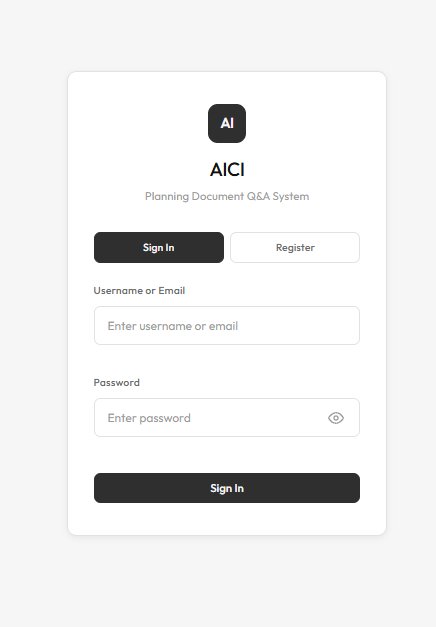
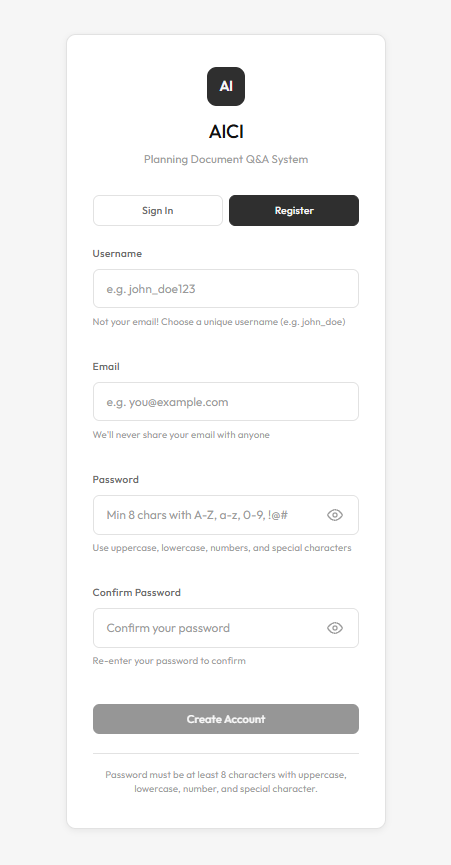
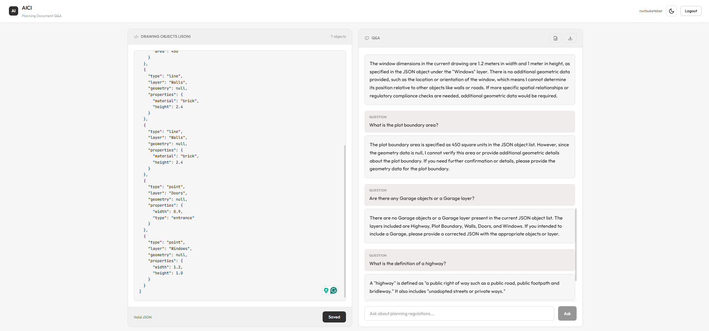
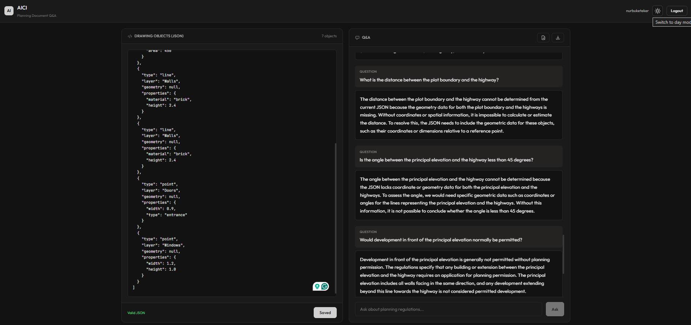
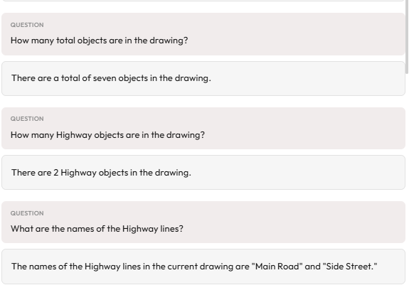
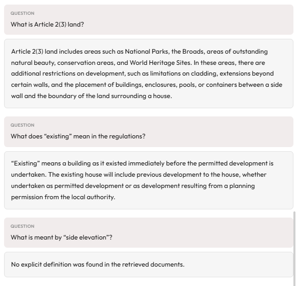
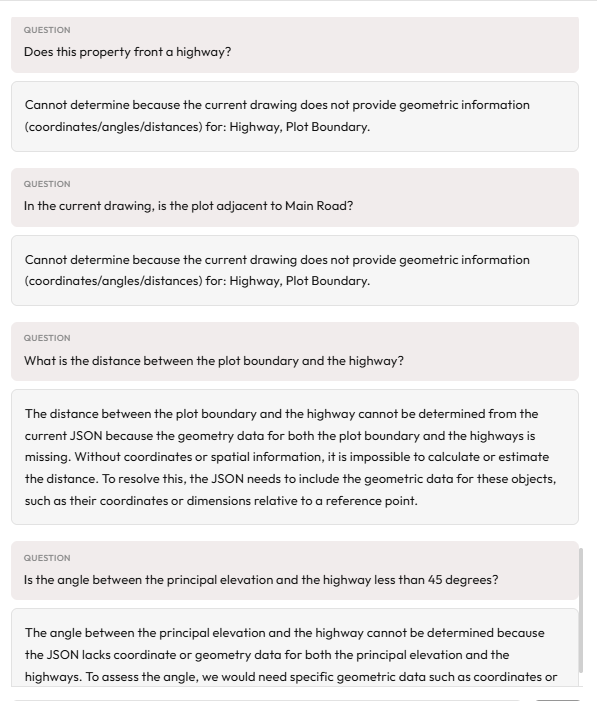
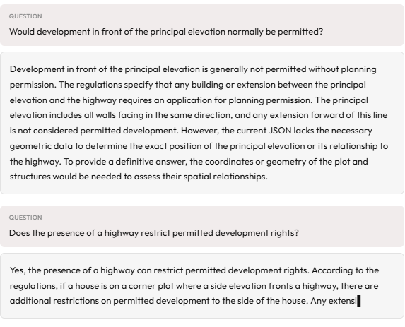
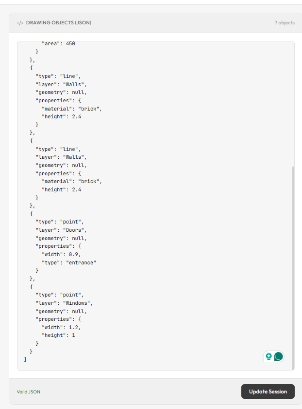
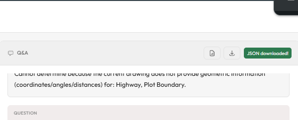

# AICI Hybrid RAG Challenge

## 1. Project Overview

This project implements a **hybrid Retrieval-Augmented Generation (RAG)** system that answers questions by combining **persistent document embeddings** with **session-specific structured drawing objects** provided as JSON. Persistent knowledge is stored in a vector database; ephemeral objects are maintained per user session and injected into each query at runtime. The **Agent is stateless**: it receives question + session JSON on every request and does not store session state.

---

## 2. Architecture Overview

```
┌─────────────────┐     ┌─────────────────┐     ┌─────────────────┐
│    Frontend     │────▶│    Backend      │────▶│     Agent       │
│   (React/Vite)  │     │   (FastAPI)     │     │   (FastAPI)     │
│   Port: 3000    │     │   Port: 8000    │     │   Port: 8001    │
└─────────────────┘     └────────┬────────┘     └────────┬────────┘
                                 │                       │
                                 ▼                       ▼
                        ┌─────────────────┐     ┌─────────────────┐
                        │     Redis       │     │   ChromaDB      │
                        │ (Session Store) │     │ (Vector Store)  │
                        └─────────────────┘     └─────────────────┘
```

**Components and responsibilities:**

- **Frontend (React):** Question input, JSON editor for drawing objects, answer and evidence display, login/register.
- **Backend (FastAPI):**
  - **Owns auth + session.** JWT authentication; session management in Redis with TTL.
  - Forwards **question + latest session objects** to the Agent on every Q&A request.
- **Agent (FastAPI):**
  - **Stateless.** No session storage; receives question and session JSON from the backend each time.
  - Hybrid RAG: vector retrieval from ChromaDB, single-step LLM reasoning over docs + session JSON.
- **Redis:** Ephemeral session storage (user-scoped JSON). **Ephemeral objects are never embedded.**
- **ChromaDB:** Persistent document embeddings only.

---

## 3. Data Model & Knowledge Separation

### 3.1 Persistent Knowledge

- PDFs are **pre-ingested** (on agent startup or via `/ingest`). Text is extracted (pypdf), chunked with **RecursiveCharacterTextSplitter** (chunk size 1000, overlap 200), and stored in **ChromaDB** with metadata (source, page, section).
- **Document embeddings** are created during ingestion and **remain fixed throughout user sessions.** They are never modified mid-session.
- ChromaDB is configured with its default sentence-transformer embedding (e.g. all-MiniLM-L6-v2). Vector store is shared and read-only for Q&A.

### 3.2 Ephemeral Session Objects

- The **JSON object list is session-scoped**: stored in **Redis** with a TTL (e.g. 1 hour). It can be **updated between queries** (PUT `/session/objects`). The backend **retrieves the latest session state from Redis for every query** and passes it to the Agent.
- **Session objects are not embedded and are not stored in the vector database.** They are sent in full (or summarized) in the LLM prompt.
- TTL is refreshed on each session update. If the session is empty or expired, the backend sends an empty list; the Agent can still answer using only document knowledge (e.g. definition-only questions).

---

## 4. Hybrid RAG Reasoning Flow

1. User submits a question (frontend).
2. Backend loads **latest session objects from Redis** for the authenticated user.
3. Backend sends `{ question, session_objects }` to the Agent.
4. Agent retrieves **relevant document chunks** from ChromaDB (semantic search, top-k).
5. Agent constructs a **single prompt** containing:
   - system instructions (docs authoritative, JSON ground truth, no hallucination);
   - user question;
   - retrieved document excerpts;
   - current session object list (pretty-printed);
   - session summary (layer counts, flags).
6. **LLM generates the answer** in one reasoning step.
7. **Evidence** (document chunks used, session layers/indices used) is returned with the answer.

**The LLM receives both persistent document excerpts and ephemeral session objects in one reasoning step, ensuring answers reflect the current session state.**

---

## 5. Prompt Design

- **System prompt** enforces: retrieved documents are authoritative; JSON is ground truth for the drawing; no inventing objects or rules; cite short phrases; end with the Evidence sentence; do not infer when geometry is missing.
- **User prompt** includes: question, pretty-printed session JSON, session summary (layer counts, plot boundary present, highways present, limitations), and retrieved regulatory excerpts. A **session summary** reduces prompt noise while keeping presence/context.
- **Doc-only routing:** For definition-style questions (e.g. “What is the definition of a highway?”), the Agent uses a **doc-only** prompt (question + retrieved chunks only, no session JSON/summary). For hybrid questions (e.g. “Does this property front a highway?”), the full prompt with JSON and summary is used.
- **Evidence** is required: the model is instructed to end with a fixed sentence; the API returns structured evidence (document chunks + session layers/indices) for the UI.

---

## 6. API Overview (Key Endpoints)

**Backend (Port 8000)**

| Method | Endpoint | Description |
|--------|----------|-------------|
| POST | `/auth/register` | Register a new user |
| POST | `/auth/login` | Login and get JWT token |
| PUT | `/session/objects` | Update session JSON objects |
| GET | `/session/objects` | Get current session objects |
| POST | `/qa` | Ask a question (hybrid RAG) |
| WebSocket | `/ws/qa` | Streaming Q&A (token in query) |

**Agent (Port 8001)**

| Method | Endpoint | Description |
|--------|----------|-------------|
| POST | `/answer` | Hybrid RAG (full response); LangChain + LangGraph |
| POST | `/answer/stream` | Same, streamed as NDJSON |
| POST | `/ingest` | Trigger PDF re-ingestion |
| GET | `/health` | Health and vector store status |
| GET | `/sync/status` | Document sync status (registry, chunks) |

### 6.1 LangChain + LangGraph-based Agent

The AI Agent service is implemented using LangChain and LangGraph as the primary framework.

- `/answer` and `/answer/stream` are orchestrated via a LangGraph StateGraph.
- Retrieval is implemented via LangChain's Chroma VectorStore and Retriever abstractions.
- LLM calls are executed through LangChain LCEL chains (sync and streaming).

There is no separate legacy pipeline; the LangGraph workflow is the single source of truth.

### 6.2 Evidence pipeline (strict correctness)

**When evidence is shown (UI):**
- **JSON_ONLY:** The Evidence section is **not rendered** at all (answers depend only on session JSON).
- **DOC_ONLY / HYBRID:** Evidence is shown but **collapsed by default**; the header shows “Sources: N document excerpts · M session objects”. A debug section “Retrieved but not used” appears only in dev mode when `include_debug: true` is set.

**Strict rules:**
- **DOC_ONLY:** Vector retrieval **must** run. Only chunks that contain the defined term and definition phrasing (e.g. “TERM – is a …”, “means”, “is defined as”) appear in `evidence.document_chunks`. If no chunk matches, the answer states “No explicit definition was found in the retrieved excerpts.” and `document_chunks` is empty (no hallucination).
- **JSON_ONLY:** Retrieval is **not** called. `evidence.document_chunks` is always empty. Only session layers/indices may appear in evidence; the UI does not show document evidence.
- **HYBRID:** Retrieval runs; evidence may include 1–3 doc chunks plus session layers. For missing-geometry guard answers, evidence includes the missing layers and optionally one regulatory excerpt.

**Retrieved vs used:** Only **used** chunks (those that pass the definition/relevance filter) appear in `evidence.document_chunks`. Raw similarity results are **retrieved** internally; they appear only in `debug.retrieved_chunks` when `include_debug: true` (or in dev in the UI).

---

## 7. Running the System Locally (Quickstart)

**Under 2 minutes:**

```bash
git clone https://github.com/NurbukeTeker/aici-conversational-rag.git
cd aici-conversational-rag

cp env.example .env
# Add OPENAI_API_KEY (required) and optionally JWT_SECRET_KEY

docker compose up --build
```

- **Frontend:** http://localhost:3000  
- **Flow:** Register → paste/edit JSON in the editor → **Update Session** → ask questions. Answers and evidence appear in the Q&A panel.

Place PDFs in `data/pdfs/` before or after first run; ingestion runs on agent startup.

**Running tests:**

```bash
# Agent tests (from repo root)
cd agent && python -m pytest tests/ -v

# Backend tests
cd backend && python -m pytest tests/ -v
```

---

## 8. Example Queries

Evaluators can use these to validate behavior:

| Type | Example query | What to expect |
|------|----------------|----------------|
| **Doc-only** | “What is the definition of a highway?” | Answer from PDF only; no session JSON in prompt. |
| **JSON-only** | “How many Highway objects are in the current drawing?” | Answer from session JSON (layer counts). |
| **Hybrid** | “Does this property front a highway?” | Answer combines PDF definition of “highway” and presence of Highway/Plot Boundary in JSON. |
| **Update session** | Modify JSON (e.g. remove Highway layer), ask the same hybrid question again. | Answer **changes** (e.g. from “yes” to “no” or “cannot determine”) because session state changed. |

---

## 9. Error Handling & Edge Cases

- **Invalid JSON:** Frontend validates before save; backend returns 422 with field-level details and an example payload. Large payloads are rejected (e.g. 512 KB / 1000 objects limit).
- **Missing geometry guard:** For spatial questions (e.g. “Does this property front a highway?”), if required layers (e.g. Highway, Plot Boundary) exist but **all** objects lack geometry, the Agent returns a deterministic message (“Cannot determine… drawing does not provide geometric information for: …”) without calling the LLM.
- **Smalltalk routing:** Short greetings (e.g. “Hi”, “Thanks”) are detected and answered with a fixed friendly reply; no retrieval or LLM call.
- **Empty session:** Backend sends an empty `session_objects` list; Agent can still answer definition-only or document-only questions; for hybrid questions the answer may state that no drawing data is available.

---

## 10. Design Decisions & Trade-offs

- **Framework:** The agent is implemented natively with LangChain and LangGraph; no procedural legacy pipeline remains in the answer path.
- **Redis for ephemeral state:** Fast, TTL-based expiry, user-scoped keys (`session:{user_id}:objects`). Fits “latest session per user” without embedding.
- **Agent is stateless:** Simplifies scaling and security; session is always supplied by the backend so the Agent never stores user data.
- **Single-step reasoning:** One retrieval + one LLM call per question. Keeps latency and complexity low; sufficient for hybrid RAG with clear prompt design.
- **Evidence returned:** Enables auditable answers; UI shows which document chunks and which JSON layers were used.
- **Evidence Policy (explicit):** Evidence is shown only when it directly supports the answer. Document excerpts appear only when the answer is grounded in PDF content (source, page, snippet). Session (JSON) evidence appears only when the answer relies on drawing data (layers and object indices). For answers that do not use documents or session (e.g. smalltalk, geometry-missing guards, follow-up prompts), the UI shows an explicit message that the answer is from system-level validation or missing input, not retrieved knowledge—no fabricated or decorative evidence.
- **Session summary:** Reduces token usage and noise while preserving layer counts and key flags (e.g. plot boundary, highways present).
- **Embedding model:** ChromaDB default is used; the pipeline can be swapped to another embedding model by configuring ChromaDB or replacing the vector store implementation.
- **LangChain + LangGraph:** Retrieval (LangChain Chroma), prompts/chains (LCEL), and orchestration (StateGraph) are the single implementation for `/answer` and `/answer/stream`.

---

## 11. Optional / Plus Features (Explicitly Called Out)

These go beyond a minimal hybrid RAG implementation:

- **Incremental PDF ingestion with content hashing** — Document registry (SHA256) for NEW/UNCHANGED/UPDATED/DELETED; only changed PDFs are re-ingested.
- **Streaming answers** — `POST /answer/stream` (NDJSON) and WebSocket `/ws/qa` for token-by-token display.
- **Geometry guards** — Deterministic answers when spatial questions are asked but required layers lack geometry; avoids LLM hallucination.
- **Evidence extraction** — Structured evidence (document chunks + session layers/indices) returned with every answer.
- **Session summaries** — Layer counts and flags computed per request and included in the prompt.
- **Doc-only routing** — Definition-style questions use a prompt without session JSON to avoid distraction.
- **Smalltalk handling** — Greetings get a fixed response without retrieval or LLM.
- **Export** — Q&A dialogue export to Excel and JSON (backend).
- **LangGraph-based agent** — `/answer` and `/answer/stream` are implemented with LangChain + LangGraph (StateGraph, LCEL chains, LangChain Chroma).

---

## 12. Repository Structure

```
├── frontend/          # React + Vite
│   ├── src/pages/     # LoginPage, Dashboard
│   ├── src/context/   # AuthContext, ThemeContext
│   ├── src/services/  # API client
│   └── Dockerfile
├── backend/           # FastAPI — auth, session, qa, export, ws
│   ├── app/           # main, auth, session, database, user_service, export_service
│   └── Dockerfile
├── agent/             # FastAPI — hybrid RAG
│   ├── app/           # main, ingestion, vector_store, document_registry, sync_service,
│   │                  # lc/ (prompts, chains), retrieval_lc, graph_lc/ (state, nodes, graph_builder),
│   │                  # reasoning, routing, smalltalk, geometry_guard, doc_only_guard, followups
│   └── Dockerfile
├── data/
│   ├── pdfs/          # Place PDFs here
│   └── sample_objects.json
├── docker-compose.yml
├── env.example
└── README.md
```

---

## 13. License & Notes

**License:** MIT

**Secrets:** Set `OPENAI_API_KEY` (and optionally `JWT_SECRET_KEY`) in `.env`; do not commit `.env`. User data is stored in SQLite (`data/users.db`); session data in Redis with TTL.

---

## 14. UI Walkthrough & Demo Scenarios

This section documents the user flow and demo scenarios with screenshots, showing what the UI looks like and what is demonstrated at each step.

### 1) Authentication Flow

#### Login

Users log in with email/username and password. Authentication is JWT-based and handled by the backend.



#### Registration

New users can register to create an account before logging in.



### 2) First Login / Initial State

#### Initial Dashboard View

After first login, the user is taken to the main dashboard. The left side shows a default JSON object list (example drawing/session data). This JSON can be edited and updated between queries.



#### Dark Mode

The dashboard supports a dark theme; users can switch between light and dark mode.



### 3) Question Types Demonstrated

This section demonstrates the different question categories supported by the hybrid RAG system.

#### JSON-only Questions

These questions are answered purely from the session JSON. No document retrieval is involved. Example questions: “How many Highway objects are in the current drawing?” or “Which layers are present in the drawing?”



#### Document-only Questions

These questions are answered using the embedded regulatory PDF documents. No session JSON is required. Example questions: “What is the definition of a highway?” or “What does the regulation say about plot boundaries?”



#### Hybrid Questions

These questions combine document rules with the current session JSON. Geometry-dependent cases may trigger a deterministic “cannot determine” response if required data is missing.



#### General Rule Questions

These questions ask for general regulatory rules (not drawing-specific). Answers explain the rule without requiring geometry.



### 4) Session Update & Sensitivity

#### Updating the Session JSON

Users can modify the JSON object list and re-run the same question. Answers change immediately based on the updated session state.



### 5) Export / Download

#### Downloading Results

Users can download or export results (e.g. JSON or Excel, depending on implementation).



### 6) Short UI Summary

This minimal interface is intentionally simple and focuses on demonstrating the core hybrid RAG capabilities: reasoning over persistent documents, dynamic session data, and correct routing between question types.
